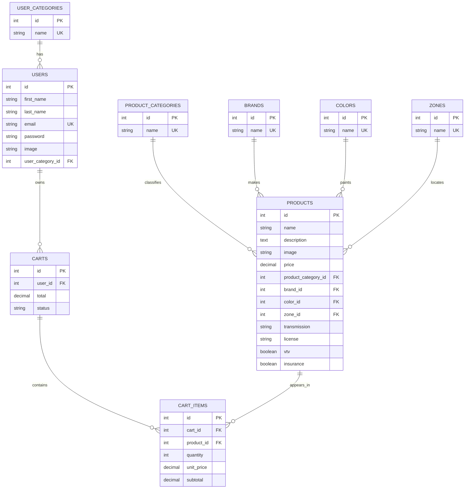

# RendiYa — Diagrama entidad-relación

Tablas en inglés para Sequelize. Relación 1:N (no N:M de colores): cada vehículo tiene un color.

```mermaid
erDiagram
  USER_CATEGORIES ||--o{ USERS : has
  PRODUCT_CATEGORIES ||--o{ PRODUCTS : classifies
  BRANDS ||--o{ PRODUCTS : makes
  COLORS ||--o{ PRODUCTS : paints
  ZONES ||--o{ PRODUCTS : locates
  USERS ||--o{ CARTS : owns
  CARTS ||--o{ CART_ITEMS : contains
  PRODUCTS ||--o{ CART_ITEMS : appears_in

  USER_CATEGORIES {
    int id PK
    string name UK
  }
  USERS {
    int id PK
    string first_name
    string last_name
    string email UK
    string password
    string image
    int user_category_id FK
  }
  PRODUCT_CATEGORIES {
    int id PK
    string name UK
  }
  BRANDS {
    int id PK
    string name UK
  }
  COLORS {
    int id PK
    string name UK
  }
  ZONES {
    int id PK
    string name UK
  }
  PRODUCTS {
    int id PK
    string name
    text description
    string image
    decimal price
    int product_category_id FK
    int brand_id FK
    int color_id FK
    int zone_id FK
    string transmission
    string license
    boolean vtv
    boolean insurance
  }
  CARTS {
    int id PK
    int user_id FK
    decimal total
    string status
  }
  CART_ITEMS {
    int id PK
    int cart_id FK
    int product_id FK
    int quantity
    decimal unit_price
    decimal subtotal
  }
```

El PDF de entrega se genera desde `src/database/der.html`.
